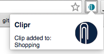
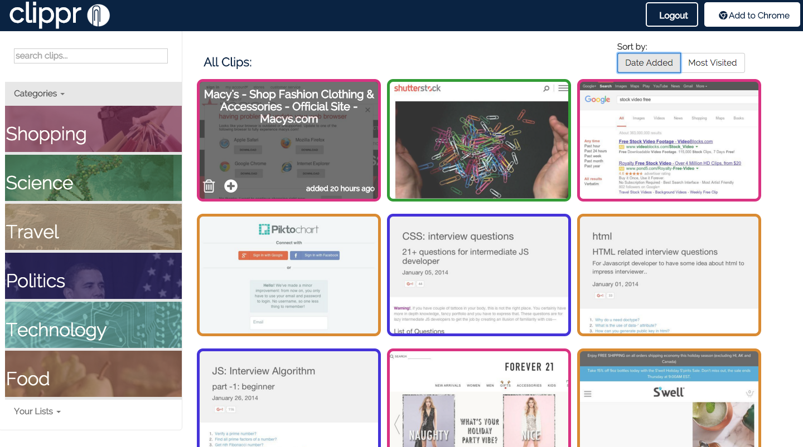

============

## Description of Project

## Demo Screenshot of clicking on Chrome Ext

## Demo Screenshot of clips page

## Table of Contents

## Features

## Installation

## Download Chrome Extension

## Built With

- Angular
- Node
- Express
- Neo4J
- Grunt
- Passport (for authentication)
- Cloudinary (for hosting images)

## APIs

- Faroo 
- Watson 

## Contribution Guide

1. [Fork it](https://github.com/BitsPleaseMKS/Clipr/fork)
2. Create your feature branch (`git checkout -b my-new-feature`)
3. Commit your changes (`git commit -am 'Add some feature'`)
4. Push to the branch (`git push origin my-new-feature`)
5. Create a new Pull Request

## Demo

## Team

 |  |  |  | 
---|---|---|---|---|
[Chris Puskar](https://github.com/cjpuskar) | [Cyrus Gomez](https://github.com/cygomez) | [Sonny Parsonage](https://github.com/sonny-qa) | [Alex Kim](https://github.com/minseokim) | [Rachel Lader](https://github.com/RachelLader)

## License 

This project is licensed under the terms of the MIT license.
